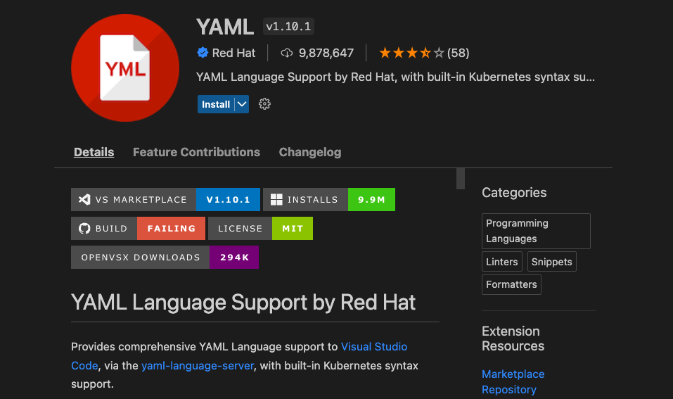

# VSCode language support for IBM Cloud Schematics Blueprints 

Create and edit blueprint templates in VSCode using the Redhat YAML language server extension and a blueprint template schema. 

The [Red Hat YAML VSCode extension](https://marketplace.visualstudio.com/items?itemName=redhat.vscode-yaml) provides a framework for editing blueprint yaml files, using a blueprint schema defined using JSON-Schema. 

Support:
- YAML language support with blueprint template schema validation
  - Validation of YAML structure and blueprint keywords 
- Autocomplete
  - Auto complete for template keywords
- Hover support
  - Hovering over a keyword shows the blueprint schema description
- Outlining for complex templates  


<br/>

## 1. Install the Red Hat YAML Language extension 

Details of the Red Hat YAML extension for VSCode 


Click on the “Extensions” button in the Activity Bar. It’s located on the side of VS Code’s client. Alternatively, you can use the keyboard shortcut “Ctrl+Shift+X” or "Cmd+Shift+X" on MacOS to open the “Extensions” screen.

This will bring you to the “Extensions” list. Type YAML in the search box and this will sort the available YAML extensions with the Red Hat extension at the top. 



Click on Install to install the extension into your workspace. 

## 2. Using the blueprint JSON schema

The blueprint JSON schema must be identified to VSCode, as it is not automatically recognised. The association of the blueprint schema can be done either in the blueprint YAML file itself using a modeline or in the VSCode User or Workspace settings under the property `yaml.schemas`.

### Associating the schema in the blueprint YAML file
It is possible to specify the blueprint schema using a modeline in the blueprint YAML file. The blueprint schema url can be a relative path to a local file or the url of the schema in the Cloud-Schematics Github repo.  

Cut and paste the following text into the blueprint YAML file, within the first few lines of the file. 

```
# yaml-language-server: $schema=https://raw.githubusercontent.com/Cloud-Schematics/vscode-blueprint-json-schema/master/blueprint_schema.json
```

### Associating the blueprint schema via user and workspace settings
Alternatively the schema can be automatically applied using file matching defined in the VSCode user or workspace settings. The `yaml.schemas` setting applies a YAML schema to a file by file matching. 

Open [user and workspace settings](https://code.visualstudio.com/docs/getstarted/settings#_creating-user-and-workspace-settings) and navigate to the `yaml.schemas` section. Cut and paste the following value onto the section. 

```
yaml.schemas: {
    "https://github.com/Cloud-Schematics/vscode-blueprint-yaml-schema/": "/*_blueprint.yaml"
}
```

# JSON Schema for Schematics Blueprints

Initial JSON Schema for template validation in VSCode using Redhat YAML extension. 

Basic validation of all required fields in Schema. 

To use schema directly from github add the `modeline`

`# yaml-language-server: $schema=https://raw.githubusercontent.com/stevestrutt/blueprint-json-schema/master/schema.json`

Alternatively download schema.json to the local filesystem. Filepath is relative to the currently active VSCode workspace. The following will locate the schema in the same directory as   

`# yaml-language-server: $schema=../schema.json`

Example templates can be found in the /templates folder


## Initial release
- All blueprint template keywords defined for Schema V1.0
- No conditional evaluation of sub-schemas, e.g. source_type > github/catalog broken at release 1.3 of YAML extension. 


